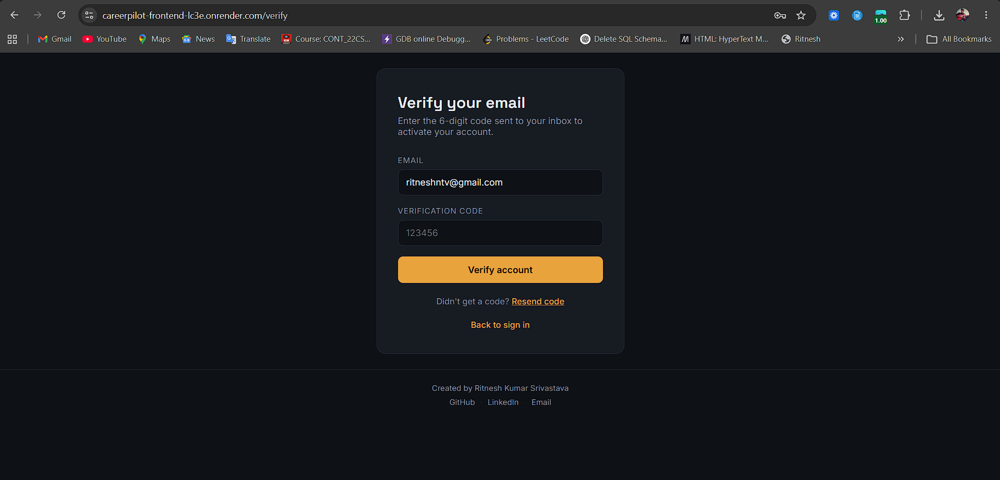
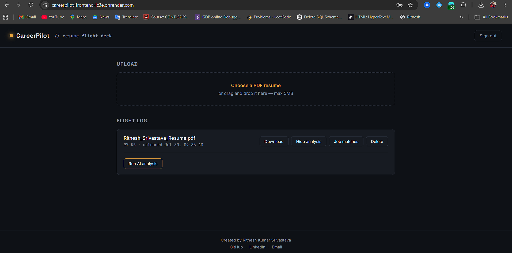
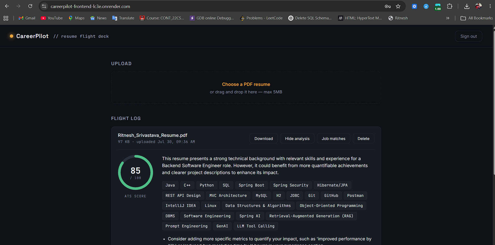
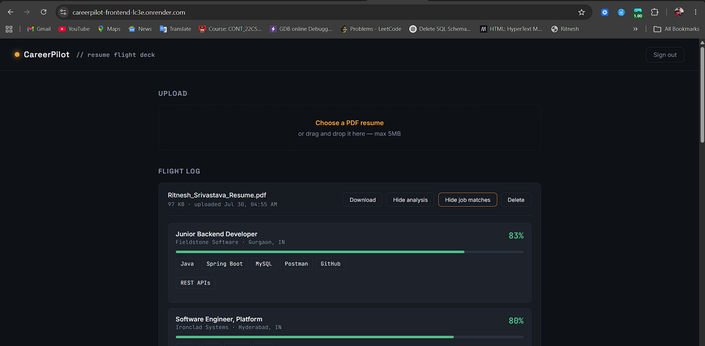

# CareerPilot


An AI-powered career preparation platform. Upload a resume and get real, AI-generated ATS scoring, skill extraction, and improvement suggestions — plus resume-to-job match scoring against live listings, all behind a secure, production-shaped Spring Boot backend with a React frontend.

Built to demonstrate backend engineering depth (JWT auth, layered architecture, async processing, structured error handling, containerized deployment) alongside genuine AI integration (Spring AI + OpenAI, structured output parsing, cost-aware caching) — not just a CRUD app with an API call bolted on.

## Live Demo

**App:** [careerpilot-frontend-lc3e.onrender.com](https://careerpilot-frontend-lc3e.onrender.com)
**API docs (Swagger):** [careerpilot-backend-3o7v.onrender.com/swagger-ui/index.html](https://careerpilot-backend-3o7v.onrender.com/swagger-ui/index.html)

> Hosted on Render's free tier — the backend spins down after ~15 minutes of inactivity, so the first request after a while may take 30–60 seconds to wake up. This is a hosting-tier limitation, not an application issue.

---

## Screenshots

### Sign up / Login


### Flight Log Dashboard


### AI Resume Analysis


### Job Matches


## Features

**Authentication**
- Registration with email OTP verification (delivered via Brevo's HTTP email API, real 6-digit codes, 10-minute expiry)
- JWT-based stateless login, BCrypt password hashing
- Resend-OTP flow for undelivered codes

**Resume Management**
- Upload (PDF, validated for type/size/integrity), download, replace, soft delete
- Paginated resume listing

**AI Resume Analysis**
- PDF text extraction (Apache PDFBox)
- Async AI analysis via OpenAI (Spring AI): ATS score, extracted skills, improvement suggestions, summary
- Structured JSON output parsing — not manually regex'd from free text
- Database-backed caching: re-analysis is skipped if a completed result already exists for the current file version

**Job Recommendation**
- Deterministic resume-to-job skill matching (explainable score, not another black-box AI call)
- Ranked results showing matched vs. missing skills per listing

**Frontend**
- React (Vite) single-page app: register → verify → login → upload → analyze → match
- Custom "flight deck" visual design, including a circular ATS-score instrument gauge

**Deployment**
- Dockerized backend, deployed on Render with a managed PostgreSQL database
- Static-hosted React frontend, also on Render
- Fully environment-variable-driven configuration — zero hardcoded secrets anywhere in the codebase

---

## System Architecture

```
                    React (Vite) Frontend
                    (Render Static Site)
                            │
                     REST API (JWT auth)
                            │
                            ▼
                  Spring Boot Backend (Docker)
                        (Render Web Service)
                            │
        ┌───────────────────┼───────────────────┐
        ▼                   ▼                   ▼
   Spring Security     Spring Data JPA      Spring AI
   (JWT filter,         (PostgreSQL,        (OpenAI, async,
   BCrypt, OTP gate)    Render-managed)      structured output)
                            │
                            ▼
                     Brevo Email API
                     (OTP delivery over HTTPS,
                      not SMTP — see Design Decisions)
```

---

## Tech Stack

| Layer | Technology |
|---|---|
| Backend | Java 21, Spring Boot 4.1 |
| Security | Spring Security, JWT, BCrypt |
| Persistence | Spring Data JPA, PostgreSQL |
| AI | Spring AI 2.0 (OpenAI), Apache PDFBox |
| Email | Brevo HTTP API |
| API Docs | Springdoc OpenAPI / Swagger UI |
| Frontend | React 18, Vite, React Router |
| Deployment | Docker, Render (Web Service + Static Site + Managed Postgres) |
| Build | Maven |

---

## Project Structure

```
careerpilot/
├── backend/          Spring Boot API
│   ├── src/
│   ├── pom.xml
│   ├── Dockerfile
│   └── mvnw
├── frontend/          React UI
│   ├── src/
│   └── package.json
└── README.md          (this file)
```

---

## Getting Started (local development)

### Prerequisites
- Java 21
- Node.js 18+
- PostgreSQL running locally
- An OpenAI API key
- A Brevo account (free) with a verified sender email and API key

### Environment variables (backend)

No credentials are hardcoded anywhere in this project. Set these before running:

| Variable | Purpose |
|---|---|
| `DATABASE_URL` | Full JDBC URL (defaults to local Postgres if unset) |
| `DB_USERNAME` | Database username (defaults to `postgres`) |
| `DB_PASSWORD` | Database password |
| `JWT_SECRET` | Secret key used to sign JWTs |
| `OPENAI_API_KEY` | OpenAI API key for resume analysis |
| `MAIL_USERNAME` | Sender email address (must be verified in Brevo) |
| `BREVO_API_KEY` | Brevo API key for sending OTP emails |

### Run the backend
```bash
cd backend
./mvnw spring-boot:run
```
API docs: `http://localhost:8080/swagger-ui/index.html`

### Run the frontend
```bash
cd frontend
npm install
npm run dev
```
App: `http://localhost:5173`

---

## Design Decisions

**Why Spring AI over calling the OpenAI SDK directly?**
Structured output parsing (`.entity(ResumeAnalysisResult.class)`) means the model's response is parsed directly into a typed Java object — no manual JSON string-splitting — plus clean Spring-idiomatic dependency injection and auto-configuration.

**Why is the AI call async?**
So the request thread returns immediately instead of blocking on an external API call. The worker that performs the actual call lives in a separate bean (`ResumeAnalysisWorker`) rather than a private method, deliberately — Spring's `@Async` proxy is bypassed on self-invocation, a common gotcha.

**Why is job matching deterministic, not another AI call?**
It's free, instant, and fully explainable — a match score has a precise, defensible reason (`matched skills / required skills`), not a black-box model output.

**Why does the database double as the AI response cache?**
A completed analysis is reused as-is unless the resume file has been replaced since. No Redis needed yet, no repeat OpenAI cost for re-viewing the same file.

**Why PostgreSQL instead of MySQL in production?**
Spring Data JPA abstracts the SQL dialect entirely — every query in this project is a JPA method call, zero raw SQL. Switching databases was a two-line config change, not a rewrite. (Two real Postgres-specific issues surfaced during migration and are fixed in the codebase: `USER` is a reserved keyword in Postgres, requiring an explicit `@Table(name = "users")`; and `@Lob` on Postgres maps Strings to large-object storage requiring transaction handling Hibernate isn't configured for by default, fixed by using explicit `TEXT` column types instead.)

**Why Brevo's HTTP API instead of Gmail SMTP for OTP emails?**
Most hosting providers, including Render's free tier, block outbound SMTP ports (25/465/587) to prevent spam abuse. An HTTP-based email API sends over standard HTTPS, which is never blocked — this works identically whether running locally or deployed.

---

## Roadmap / Future Enhancements

- AI chat assistant (RAG over the user's own resume)
- Cover letter generator
- Mock interview simulator
- Refresh token rotation, RBAC, admin panel
- Redis caching, rate limiting, structured logging, CI/CD

---

## License

This project is licensed under the [MIT License](LICENSE) — free to use, modify, and learn from.

---

## Author
---


**Made with ❤️ by Ritnesh Kumar Srivastava**


Computer Science Engineering Graduate
- GitHub: [RitneshSrivastava](https://github.com/RitneshSrivastava)
- LinkedIn: [ritneshks](https://www.linkedin.com/in/ritneshks)


